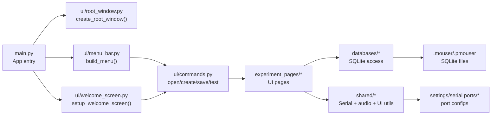
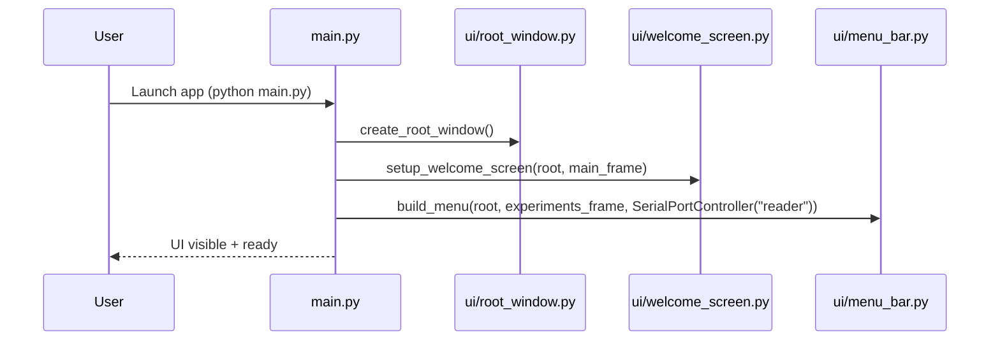
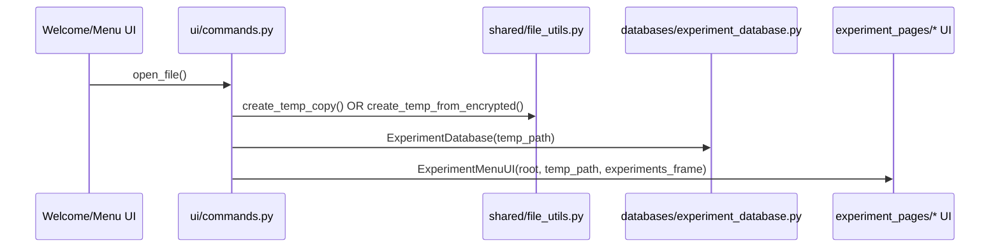
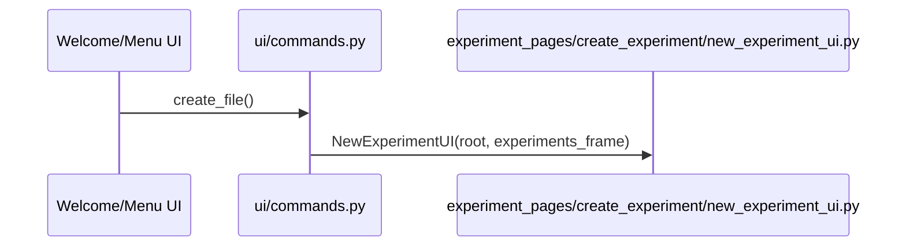
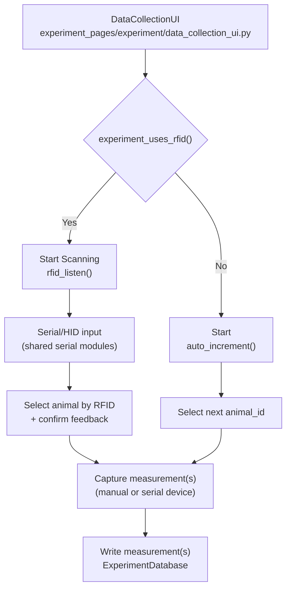
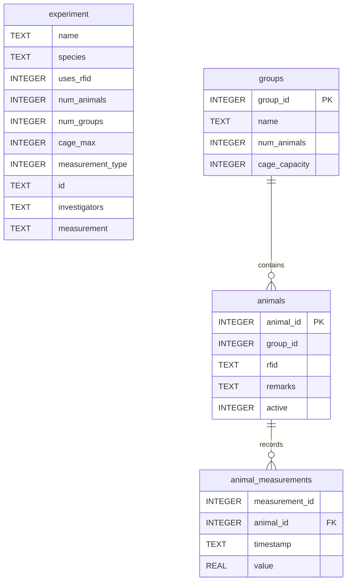

# Checkpoint Artifact (Choice): **System Designs** — Mouser

**Project:** Mouser  
**Checkpoint Catalog Item:** System Designs  
**Artifact Type:** Markdown document (fixed-format)  
**Date:** 2026-04-10  

## Artifact identification + rationale

This artifact fulfills the **System Designs** checkpoint by documenting Mouser's current architecture in a single, contributor-friendly reference. Mouser spans multiple concerns (UI pages, serial/hardware integration, and SQLite-backed experiment files), and without a clear system map it is harder to onboard contributors, scope issues, and evolve the product safely.

We selected **System Designs** because it directly supports the final product and community strategy: it reduces onboarding friction, helps maintainers point newcomers to the right modules, and makes it easier to write high-quality issues ("this flow breaks between UI and DB") and plan roadmap work. This pairs naturally with contributor onboarding work by adding the missing technical overview.

---

## System overview

Mouser is a desktop application (Python + Tk/CustomTkinter) for creating/opening experiment files and collecting measurements with minimal user interaction. It integrates with:

- **UI layer:** CustomTkinter pages and dialogs
- **Hardware I/O:** serial ports (RFID readers, balances/calipers), with HID keyboard-wedge fallback in some flows
- **Storage:** SQLite experiment databases saved as `.mouser` (plain) or `.pmouser` (encrypted) files

---

## Repository/module architecture (static view)

### Major folders and responsibilities

- `main.py` — application entry point: creates the root window, sets geometry, initializes shared state, and starts `mainloop()`.
- `ui/` — top-level UI scaffolding (root window factory, menu bar, welcome screen) and centralized UI command callbacks.
- `experiment_pages/` — the primary application pages for experiment creation, configuration, collection, and analysis.
- `shared/` — shared utilities and cross-cutting concerns (serial, audio, resource loading, UI helpers/models).
- `databases/` — SQLite access layer and controllers for reading/writing experiment data.
- `settings/` — serial port configuration files used by the serial port controller and settings UI.

### High-level component diagram

---

## Runtime flows (dynamic view)

### 1) Application startup

---

### 2) Experiment file lifecycle (open/create/save)

#### Open existing experiment (`.mouser` or `.pmouser`)

**Key design choice:** the app works on a **temporary copy** of the experiment DB file during runtime. "Save" writes the temp DB back to the original `.mouser` path or re-encrypts for `.pmouser`.

#### Create a new experiment

---

### 3) Data collection (RFID vs non-RFID)

At a high level, Mouser supports two primary "identify the animal" modes:

- **RFID mode:** the app listens for an RFID scan, then associates measurements with the scanned animal.
- **Non-RFID mode:** the app walks through animals (auto-increment) and records measurements for the current animal.

---

## Data model (SQLite)

The experiment file is a SQLite database. Core tables created by `ExperimentDatabase._initialize_tables()`:

---

## Extension points (for contributors)

- **UI actions:** add/route a new menu option via `ui/menu_bar.py` -> `ui/commands.py`.
- **New pages:** implement additional flows as a page under `experiment_pages/...` and use shared frame helpers from `shared/tk_models.py`.
- **Serial devices:** extend patterns in `shared/serial_port_controller.py`, `shared/serial_listener.py`, and `shared/serial_handler.py`.
- **Persistence:** extend `databases/experiment_database.py` with backward-compatible initialization for new tables/fields.

